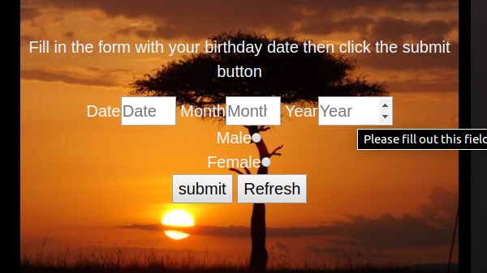

# Checking AKAN Name
#### key in your birthdate and see your Akan name, version 28.10.2019
#### By
* Stephen
* Brian
* Prof

## Description
This web application takes a user's birthday and calculates the day of the week they were born and then depending on their gender outputs their Akan Name will be displayed.
Akan names are derived from Ghanian culture. Frequently in Ghana, children are given their first name as a 'day name' which corresponds to the day in the
 week they were born. Feel free to try out and see what happens

# screenshot

This is the first page to the website

This is where a user input their data of birth 

This is where their Akan name will be displayed after submiting their details

## Setup/Installation Requirements
* web browser of the latest versions are highly recomended
## Known Bugs
No known bugs.
## Technologies Used
The languages and tools used to create this app are:
* HTML
* CSS
* JAVASCRIPT
## Support and contact details
In case of any issues you can contact me via:
* my email which is ngumbausteph@gmail.com or
* my phone number which is +254718659266
## License
*This is an personal document that cannot be used anywhere else other than by the creater of the site*
Copyright (c) 2019
**{Swiftnet Technologies}**